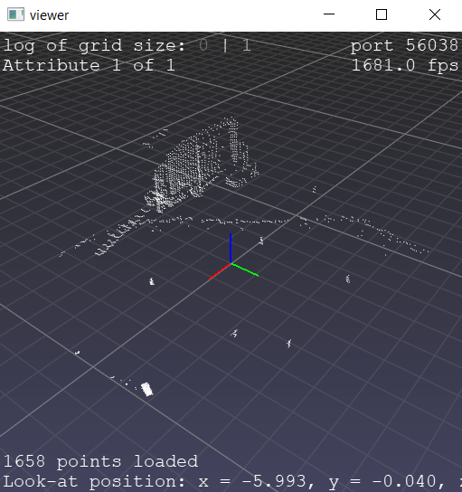
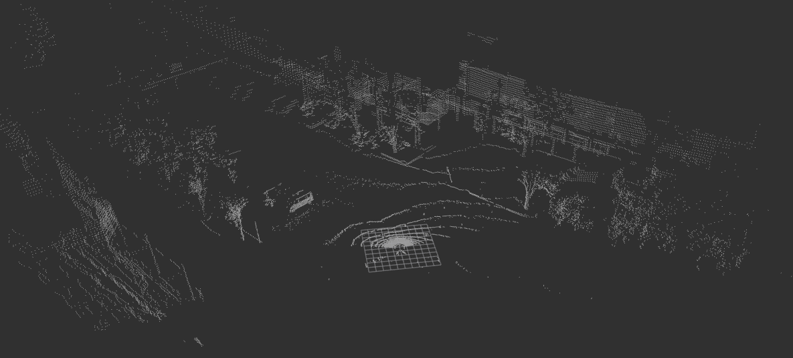

# LiDAR-perception

## Označování kuželů

```
cd dataset
pip install -r requirements.txt
python main.py
```

### Ovládání

- Výběr bodů: CTRL+mouse
- Zrušení výběru: right click
- Potvrzení výběru: enter
- Přechod na další pointcloud: prázdný výběr + enter



