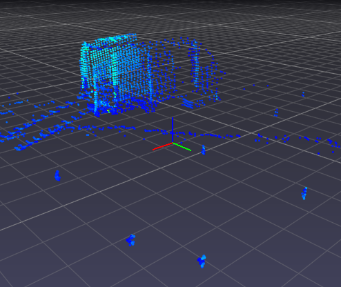

# Nováčkovský úkol

Ve složce `pointclouds` je několik pointcloudů,
ve kterých je třeba označit kužely. V každém poitcloudu se
většinou nachází několik kuželů viz. obrázky níže.




Označování je částečně automatizováno pomocí skriptu `label-cones.py`
Vzhledem k tomu, že použitá knihovna pptk na Windowsech trochu zlobí je tu popsán návod jak pro Windows, tak pro Linux. Pokud máte možnost, použijte Linux, jelikož je ten skript monohem více user-friendly.

## Linux
pptk na Linuxu funguje, doporučuji verzi 3.6 ale 3.7 by měla fungovat také. pptk je z nějakého důvodu distrubuováno se špatnou verzí jedné knihovny a je potřeba ji nahradit tou systémovou. Zde jsou příkazy, které by pptk měli sprovoznit. U posledních dvou nahraďte v cestě python3.6 vaší verzí pythonu.

```bash
# navigate to the folder
cd dv-hackathon

# create venv
python3 -m venv venv
# activate venv
source venv/bin/activate
# install dependencies
python3 -m pip install numpy pptk

# fix library
rm ./venv/lib/python3.6/site-packages/pptk/libs/libz.so.1
ln -s /usr/lib/libz.so.1 ./venv/lib/python3.6/site-packages/pptk/libs/libz.so.1
```

Skript `label-cones.py` má následující signaturu:

```bash
python3.6 label-cones.py input_path output_path start end
```

`input_path` je cesta ke složce s pointcloudy.
`output_path` je cesta ke složce s kužely.
Skript prochází pointcloudy v dané složce od `start` do `end` (včetně)
Pokud chceme označit prvních 10 kuželů, bude to vypadat takto:
```
python3 label-cones.py pointclouds cones 1 10
```

## Ovládání
Kužely označujeme jeden po druhém. Výběr se provede držením CTRL a levým tlačítkem myši. Vybrané body jsou vždy žluté. Pokud máte vybrány včechny body pro daný kužel zmáčkněte enter. Kužel se uloží a vybrané body se zobrazí červeně, aby se odlišily od ostatních. Takto postupujte dál, dokud jsou v pointcloudu nevybrané kužely. Když máte hotovo, stačí zmáčknout enter s prázdným výběrem a skript automaticky kužely uloží a přejde na další pointcloud.

